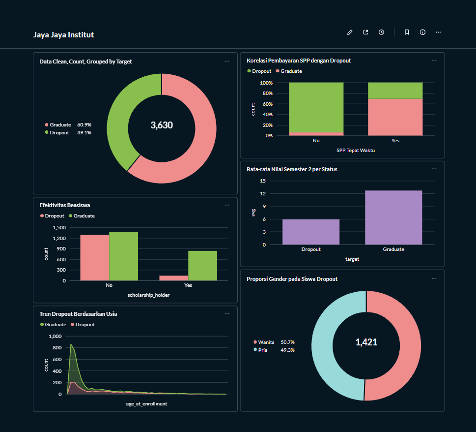
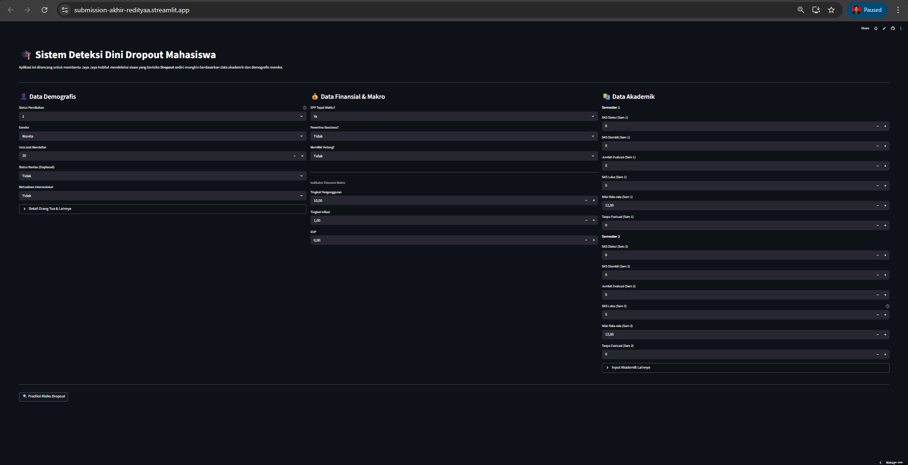

# Proyek Akhir: Menyelesaikan Permasalahan Institusi Pendidikan

## Business Understanding
Jaya Jaya Institut merupakan salah satu institusi pendidikan perguruan tinggi yang telah berdiri sejak tahun 2000. Hingga saat ini, institusi telah mencetak banyak lulusan dengan reputasi yang sangat baik. Namun, data internal menunjukkan adanya tingkat *dropout* (putus kuliah) yang cukup tinggi. Hal ini menjadi ancaman bagi reputasi institusi dan efisiensi operasional. Oleh karena itu, diperlukan pendekatan berbasis data untuk mendeteksi potensi *dropout* sedini mungkin agar intervensi yang tepat dapat dilakukan.

### Permasalahan Bisnis
Masalah utama yang dihadapi adalah tingginya rasio siswa yang tidak menyelesaikan pendidikan. Secara spesifik, tantangannya adalah:
1.  **Ketidakmampuan mendeteksi dini:** Pihak institusi baru menyadari siswa akan *dropout* ketika siswa tersebut sudah berhenti masuk atau menunggak pembayaran dalam waktu lama, sehingga terlambat untuk diberi bimbingan.
2.  **Kurangnya wawasan faktor penyebab:** Belum adanya pemetaan yang jelas mengenai faktor dominan (apakah finansial, akademik, atau demografis) yang paling mempengaruhi keputusan siswa untuk keluar.

### Cakupan Proyek
Proyek ini mencakup seluruh siklus Data Science (*End-to-End*):
1.  **Data Analysis & Exploration:** Menganalisis dataset historis siswa untuk menemukan pola *churn/dropout*.
2.  **Dashboard Monitoring:** Membuat visualisasi interaktif untuk memantau performa siswa dan faktor risiko.
3.  **Predictive Modeling:** Membangun model Machine Learning untuk memprediksi probabilitas *dropout* siswa.
4.  **Deployment:** Menyediakan aplikasi berbasis web (Streamlit) yang dapat digunakan oleh dosen/staf akademik untuk memeriksa risiko siswa secara *real-time*.

### Persiapan

Sumber data: [Dataset Jaya Jaya Institut](https://github.com/dicodingacademy/dicoding_dataset/tree/main/students_performance)

**Setup environment:**

**Untuk Windows:**

```
# Membuat venv
python -m venv venv

# Mengaktifkan venv
venv\Scripts\activate
```

**Untuk macOS / Linux:**

```
# Membuat venv
python3 -m venv venv

# Mengaktifkan venv
source venv/bin/activate
```
**Instalasi Dependensi**
```
pip install -r requirements.txt
```

## Business Dashboard
Dashboard bisnis telah dibuat untuk memudahkan manajemen Jaya Jaya Institut memantau kondisi makro mahasiswa. Dashboard ini memvisualisasikan korelasi antara status kelulusan dengan faktor kunci seperti keterlambatan pembayaran SPP, distribusi nilai akademik, dan usia pendaftar.

**Link Dashboard:** (Akses melalui localhost setelah menjalankan container Docker)

Metabase Dashboard Preview:  

**Cara Menjalankan Dashboard (Docker):** Untuk mengakses dashboard beserta database yang telah dikonfigurasi, jalankan perintah berikut di terminal:
```
docker run -d -p 3000:3000 --name metabase metabase/metabase
```

Kredensial Akses Metabase:

URL: http://localhost:3000

Username: root@mail.com

Password: Root123

Insight utama dari Dashboard:

- Mahasiswa yang menunggak pembayaran SPP memiliki kecenderungan dropout yang sangat tinggi.

- Efektivitas Beasiswa untuk mahasiswa yang tidak mendapatkannya cenderung tinggi.

- Nilai semester 2 yang dropout hanya mendapatkan di angka 6.

## Menjalankan Sistem Machine Learning
Sistem prediksi risiko dropout telah dikembangkan menggunakan algoritma Random Forest Classifier yang mencapai akurasi ~90%. Sistem ini dikemas dalam bentuk aplikasi web interaktif menggunakan Streamlit.

Streamlit Dashboard Preview: 

**Cara Menjalankan Prototype (Lokal)**
Pastikan seluruh dependensi sudah terinstal.

Jalankan perintah berikut di terminal:
```
streamlit run app.py
```

**Akses Prototype (Cloud)**

Aplikasi ini telah di-deploy dan dapat diakses secara online melalui tautan berikut:

**Link Streamlit App:** [streamlit submission](https://submission-akhir-redityaa.streamlit.app/)

## Conclusion
Berdasarkan analisis data dan pemodelan yang dilakukan, dapat disimpulkan bahwa:

**Faktor Akademik adalah Indikator Utama:** Variabel ``Curricular units 2nd sem (approved)`` (SKS yang lulus di Semester 2) dan ``Curricular units 2nd sem (grade)`` (Nilai rata-rata Semester 2) adalah fitur yang paling berpengaruh (Top Feature Importance). Mahasiswa yang gagal mengamankan SKS di tahun pertama kuliah memiliki risiko dropout tertinggi.

**Faktor Finansial Sangat Kritis:** Status pembayaran uang kuliah (``Tuition fees up to date``) menjadi penentu kedua. Hampir seluruh mahasiswa yang tidak membayar SPP tepat waktu berakhir dengan status dropout.

**Efektivitas Model:** Model Machine Learning mampu memprediksi status siswa (Lulus/Dropout) dengan akurasi 90%, sehingga layak digunakan sebagai alat bantu pengambilan keputusan.

### Rekomendasi Action Items
Untuk menurunkan angka dropout, direkomendasikan agar Jaya Jaya Institut melakukan langkah-langkah berikut:

### Rekomendasi Action Items
Berdasarkan hasil analisis data dan temuan visual dari dashboard yang telah dibuat, berikut adalah rekomendasi strategis bagi Jaya Jaya Institut:

1.  **Intervensi Dini pada Keterlambatan Pembayaran SPP (Financial Support)**
    * **Dasar Data:** Visualisasi *"Korelasi Pembayaran SPP dengan Dropout"* menunjukkan pola yang sangat mutlak. Hampir seluruh mahasiswa yang status pembayaran SPP-nya *not up to date* (bar "No") berakhir dengan status *Dropout*. Sebaliknya, tingkat kelulusan sangat tinggi pada mahasiswa yang tertib membayar.
    * **Rekomendasi:** Institusi harus mengubah pendekatan penagihan menjadi pendekatan konseling finansial. Segera tawarkan skema cicilan (installment) atau restrukturisasi pembayaran bagi mahasiswa yang terdeteksi terlambat membayar, karena ini adalah sinyal *churn* paling awal dan paling kuat.

2.  **Pemantauan Ketat Indeks Prestasi di Semester 2**
    * **Dasar Data:** Grafik *"Rata-rata Nilai Semester 2 per Status"* memperlihatkan kesenjangan performa yang signifikan. Mahasiswa yang lulus (Graduate) memiliki rata-rata nilai sekitar **13**, sedangkan mahasiswa yang *Dropout* rata-ratanya hanya di kisaran **6**.
    * **Rekomendasi:** Tetapkan nilai rata-rata Semester 2 di bawah **10** sebagai ambang batas bahaya (*danger zone*). Mahasiswa yang performanya menyentuh angka ini wajib masuk dalam program bimbingan akademik intensif atau *mentoring* sebaya, karena data menunjukkan risiko kegagalan mereka sangat tinggi.

3.  **Ekspansi Program Beasiswa Sebagai Alat Retensi**
    * **Dasar Data:** Grafik *"Efektivitas Beasiswa"* menunjukkan bahwa proporsi *Dropout* pada penerima beasiswa (*Scholarship holder: Yes*) sangat minim dibandingkan dengan non-penerima beasiswa.
    * **Rekomendasi:** Beasiswa terbukti efektif menahan laju *dropout*. Disarankan untuk mengalokasikan dana beasiswa khusus "Retensi" bagi mahasiswa tingkat awal yang memiliki potensi akademik baik namun terindikasi memiliki kendala finansial (seperti pada poin 1), untuk mencegah mereka berhenti kuliah.
